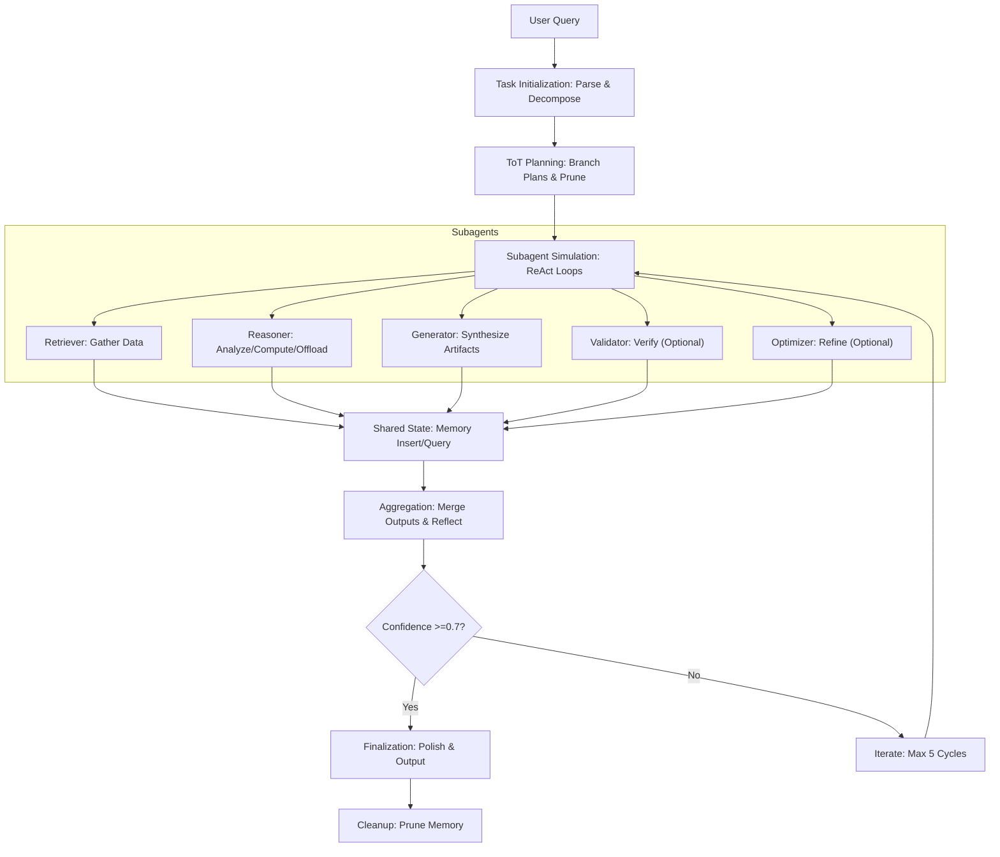
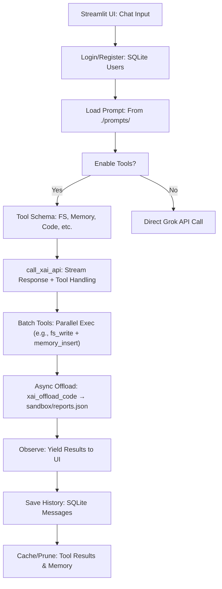
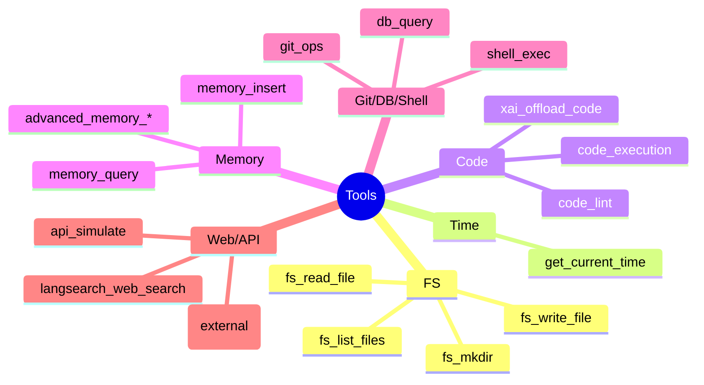

# Apex Orchestrator 2: With Grok-Code Sidekick

[](https://opensource.org/licenses/MIT)
[](https://www.python.org/downloads/release/python-3120/)
[](https://x.ai/)
[](https://www.raspberrypi.com/products/raspberry-pi-5/)
[](https://github.com/ellerbrock/open-source-badges/)
[](https://github.com/buckster123/ApexOrchestrator-2/actions)


 <!-- Replace with actual banner image URL -->

**Agents For Everyone** – Empowering hobbyists, tinkerers, and tech enthusiasts to build and deploy autonomous AI agents on affordable hardware like the Raspberry Pi 5. Apex Orchestrator is your DIY gateway to modular, tool-empowered AI workflows, blending ReAct reasoning with xAI's Grok models for efficient, sandboxed task execution.

## Table of Contents

- [What is Apex?](#what-is-apex)
- [Key Features](#key-features)
- [Architecture Overview](#architecture-overview)
  - [ReAct Workflow Flowchart](#react-workflow-flowchart)
  - [Backend Python Logic Flow](#backend-python-logic-flow)
  - [Tool Integration Diagram](#tool-integration-diagram)
- [Setup Guide: From Clean OS Install on Raspberry Pi 5](#setup-guide-from-clean-os-install-on-raspberry-pi-5)
- [Usage Guide](#usage-guide)
- [Customizing Apex](#customizing-apex)
- [Contributing](#contributing)
- [License](#license)
- [Acknowledgements](#acknowledgements)

## What is Apex?

Apex Orchestrator is an open-source, low-cost AI agent platform designed for autonomous task handling across domains like data analysis, code generation, research, and file management. Built on a Python backend with Streamlit UI, it integrates xAI's Grok API for intelligent reasoning and tool execution in a fully sandboxed environment.

At its core, Apex simulates a multi-agent system using **ReAct (Reason + Act)**, **Chain-of-Thought (CoT)**, and **Tree-of-Thought (ToT)** patterns. It acts as a "main orchestrator" that dynamically spins up 3-5 virtual subagents (e.g., Retriever for data gathering, Reasoner for analysis) to break down and solve complex queries efficiently.

Why "Agents For Everyone"? Apex runs on a Raspberry Pi 5 with minimal setup, making advanced AI accessible without cloud dependency or high-end GPUs. It's perfect for edge computing, home automation, personal projects, or even as a learning tool for AI enthusiasts. With built-in stability checks, error handling, and modularity, it's robust yet hackable – think of it as your personal JARVIS on a budget.

Apex leverages a stateful REPL for code execution, semantic memory via embeddings (Sentence Transformers + ChromaDB), and async offloading for heavy tasks. It's not just an app; it's a framework for experimenting with agentic AI.

## Key Features

- **Multi-Agent Simulation**: Internal orchestration of subagents for robust task decomposition.
- **Tool Arsenal**: 18+ tools including FS ops, code execution, web search, Git, DB queries, and more – all sandboxed.
- **Reasoning Engines**: ReAct loops with CoT/ToT for step-by-step validation and branching.
- **Memory System (EAMS)**: Hierarchical, semantic memory with consolidation, retrieval, and pruning.
- **xAI Integration**: Seamless API calls to Grok models; offload to specialized instances for code-heavy tasks.
- **UI/UX**: Streamlit-based chat app with themes, history, image uploads, and tool toggles.
- **Hardware-Friendly**: Optimized for Raspberry Pi 5; low-resource footprint.
- **Security**: Restricted builtins, whitelisted commands, cached tools to prevent loops/abuse.
- **Extensibility**: Custom prompts, async offloads, and open-source for forking.

Performance Metrics (on Pi 5):
- Avg. Task Cycles: 3-5
- Memory Usage: ~500MB idle
- API Latency: <2s per call

## Architecture Overview

Apex's design emphasizes modularity: A frontend UI feeds queries to the backend, where the agent prompt drives ReAct-based orchestration. Tools interact with a sandbox, memory DB, and external APIs.

### ReAct Workflow Flowchart

Here's a Mermaid diagram of the core ReAct loop in Apex:



This loop ensures efficiency: Think (plan), Act (tools), Observe (results), Reflect (score/fix).

### Backend Python Logic Flow

The backend script handles API calls, tool execution, and state:



Key: Async for offloads via asyncio; caching with TTL to optimize Pi resources.

### Tool Integration Diagram

Tools are batched and error-handled:



Integration: All routed through ReAct; fallbacks (e.g., offload fail → local code_exec).

## Setup Guide: From Clean OS Install on Raspberry Pi 5

Assuming a fresh Raspberry Pi 5 (4GB/8GB recommended). We'll use Raspberry Pi OS (64-bit) for optimal performance.

### Step 1: Hardware Prep
- Insert/connect storage (16GB+ SD104 might do, but an nvme or fast usb 3 ssd is highly recommended, if not needed, for optimal performance) into Pi 5.
- Connect HDMI, keyboard, mouse, power (27W USB-C recommended for stability).
- Boot up; follow on-screen setup (WiFi, locale).

### Step 2: OS Install & Update
- Download [Raspberry Pi Imager](https://www.raspberrypi.com/software/), or boot to netinstall bootloader.
- Flash Raspberry Pi OS Lite (64-bit) to Nvme/SSD/SD, or net install 64 Bit Bookworm Raspi Os Lite or Desktop.
- Boot Pi.
- Login (default: pi/raspberry).
- Run:
  ```
  sudo apt update && sudo apt full-upgrade -y
  sudo apt install python3-pip python3-venv git -y
  sudo raspi-config  # Enable SSH, VNC if needed; set GPU memory to 128MB for ML tools
  sudo reboot
  ```

### Step 3: Clone Repo & Env Setup
- Clone Apex:
  ```
  git clone https://github.com/buckster/ApexOrchestrator-2.git
  cd AOXCODER
  ```
- Create venv:
  ```
  python3 -m venv .venv
  source .venv/bin/activate
  pip install -r requirements.txt  # Assumes you create one with all pip installs from script
  ```
- Requirements.txt sample (extract from script):
  ```
streamlit
openai
passlib
python-dotenv
ntplib
pygit2
requests
black
numpy
sentence-transformers
torch
jsbeautifier
pyyaml
sqlparse
beautifulsoup4
chromadb
  ```

### Step 4: API Keys & Config
- Create `.env`:
  ```
  XAI_API_KEY=your_xai_key  # From x.ai
  LANGSEARCH_API_KEY=your_langsearch_key  # Optional for web search
  ```
- Setup sandbox: `mkdir sandbox`

### Step 5: Run Apex
- Activate venv: `source .venv/bin/activate`
- Launch: `streamlit run AOXCODER.py` (rename script to app.py)
- Access: http://<pi-ip>:8501 (find IP with `hostname -I`)

Troubleshooting:
- Pi overheating? Add heatsink/fan.
- Memory errors? Use Grok-3 mini for lighter loads.
- No UI? Ensure X11/VNC if headless.

For clean OS tweaks: Overclock CPU to 2.7GHz via `raspi-config` for snappier ReAct cycles.

## Usage Guide

1. **Login/Register**: Secure SQLite-backed auth.
2. **Select Prompt**: Choose from ./prompts/ (e.g., tools-enabled.txt for full power).
3. **Chat**: Type queries; enable tools for autonomy.
4. **Offload Example**: "Debug this JS code" → Apex detects, offloads to Grok-code, polls report.
5. **History**: Search/load past convos.
6. **Customize**: Edit prompts for new agents (e.g., "MathBot.txt").

Pro Tip: For nerdy experiments, hook to GPIO via code_execution for Pi hardware control.

## Customizing Apex

- **Add Tools**: Extend TOOLS list; implement in script.
- **New Subagents**: Tweak prompt's workflow section.
- **Scale**: Run on cluster; add load balancing for API calls.
- **Debug**: Check app.log for traces.

## Contributing

Fork → Branch → PR. Follow PEP8; add tests. Issues welcome for Pi optimizations or new tools.

- **Roadmap**: Voice mode, multi-model switching, edge ML integration.
- **Code Style**: Black-formatted; 88-char lines.

## License

MIT – Free as in beer (or Pi). See [LICENSE](LICENSE).

## Acknowledgements

- xAI for Grok API.
- Streamlit for slick UI.
- Open-source libs: ChromaDB, Sentence Transformers, etc.
- Community: Raspberry Pi forums, AI tinkerers everywhere.

*Built with <3 on a Pi 5 – Agents For Everyone!*
